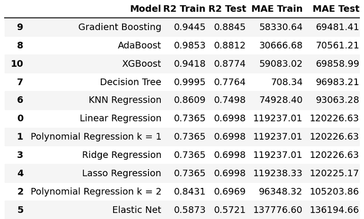

# Houses Sales in King County, USA

[House Sales in King County, USA](https://www.kaggle.com/harlfoxem/housesalesprediction) is a dataset provided by [harlfoxem](https://www.kaggle.com/datasets/harlfoxem/housesalesprediction) which contains house sales prices for King County sold between may 2014 and may 2015. 

## Table of contents

- [Getting Started](#getting-started)
- [Models Performances](#models-performances)

## Getting started

The [notebook](./notebooks/USA_housing_analysis.ipynb) focus on how to find the best features using Filter Methods, Wrapper Methods and Embedded Methods. After that, several evaluations were performed with different regression models (Linear Regression, Polynomial Regression, KNN Regression, Ridge Regression, Lasso Regression, Elastic Net Regression, Random Forest, Decision Tree, XGBoost, AdaBoost and Gradient Boosting).

A [model.py](./usa_housing/model.py) file was also created using model that obtained the best metrics.

To start the model from the python console, write ```make run_model```, which will show the metrics of the chosen model to predict the price of a house in King County.


## Models performances

**MAE error and R2 square metrics for differents Machine Learning Regression models**



To see more, check the [notebook](./notebooks/USA_housing_analysis.ipynb).

